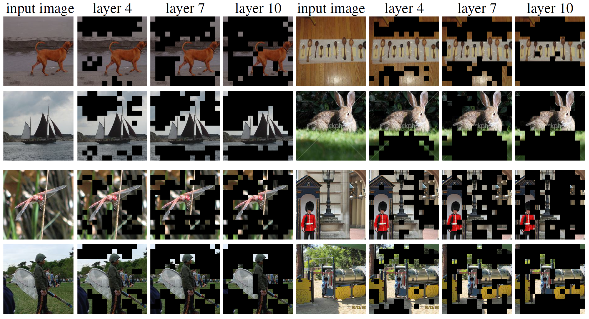
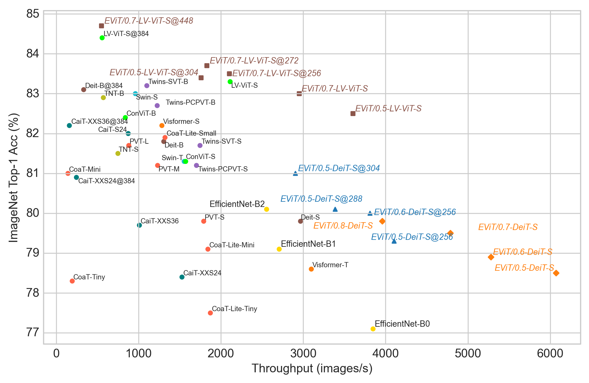

# Expediting Vision Transformers via Token Reorganizations

This repository contains PyTorch evaluation code, training code and pretrained __EViT__ models for the ICLR 2022 Spotlight paper:
> [Not All Patches are What You Need: Expediting Vision Transformers via Token Reorganizations](https://arxiv.org/abs/2202.07800)
> 
> _Youwei Liang, Chongjian Ge, Zhan Tong, Yibing Song, Jue Wang, Pengtao Xie_

The proposed EViT method reduces computation by progressively discarding or fusing inattentive tokens in Vision Transformers, as illustrated in the following figure.



EViT obtains competitive tradeoffs in terms of speed / precision:



If you use this code for a paper please cite:

```
@inproceedings{liang2022evit,
title={Not All Patches are What You Need: Expediting Vision Transformers via Token Reorganizations},
author={Youwei Liang and Chongjian Ge and Zhan Tong and Yibing Song and Jue Wang and Pengtao Xie},
booktitle={International Conference on Learning Representations},
year={2022},
url={https://openreview.net/forum?id=BjyvwnXXVn_}
}
```

# Model Zoo

We provide EViT-DeiT-S models pretrained on ImageNet 2012.

| Token fusion | Keep rate | Acc@1 | Acc@5 | MACs (G) | Throughput (img/s) | #Params | URL |
| --- | --- | --- | --- | --- | --- | --- | --- |
| &check; | 0.9 | 79.8 | 95.0 | 4.0 | 3197 | 22.1M | [model](https://drive.google.com/file/d/1CmROmlLV-7nyYY-Bhph8_5ut3wFwqvny/view?usp=sharing) |
| &check; | 0.8 | 79.8 | 94.9 | 3.5 | 3619 | 22.1M | [model](https://drive.google.com/file/d/1BTJyIe0zVK3zYXz3BzIlSC4YZCnZu7cJ/view?usp=sharing) |
| &check; | 0.7 | 79.5 | 94.8 | 3.0 | 4385 | 22.1M | [model](https://drive.google.com/file/d/1FfvdEBss9f8gexjqEY8vOSUQe_8qwYuL/view?usp=sharing) |
| &check; | 0.6 | 78.9 | 94.5 | 2.6 | 4722 | 22.1M | [model](https://drive.google.com/file/d/1D1m067jDbyG0g2UjyBMaJ4NTT2Ad8vrv/view?usp=sharing) |
| &check; | 0.5 | 78.5 | 94.2 | 2.3 | 5408 | 22.1M | [model](https://drive.google.com/file/d/1-nyxAlRWjD2icbgj3Y3YWcCmYj9sTgfD/view?usp=sharing) |
| &cross; | 0.9 | 79.9 | 94.9 | 4.0 | 3201 | 22.1M | [model](https://drive.google.com/file/d/1tSaPLged8ED2RTiN5ttSmeTNIw1aNNwV/view?usp=sharing) |
| &cross; | 0.8 | 79.7 | 94.8 | 3.5 | 3772 | 22.1M | [model](https://drive.google.com/file/d/1zdFbHk-gOw_Wiid5_Z8NFcBa1HMI-JF-/view?usp=sharing) |
| &cross; | 0.7 | 79.4 | 94.7 | 3.0 | 4249 | 22.1M | [model](https://drive.google.com/file/d/1VCZGphW34rFWZDXOoF7XO4EJfRLZ-YB8/view?usp=sharing) |
| &cross; | 0.6 | 79.1 | 94.5 | 2.6 | 4967 | 22.1M | [model](https://drive.google.com/file/d/1okYcKryyD6FFPG9v5r40R28SRNfVZ5X0/view?usp=sharing) |
| &cross; | 0.5 | 78.4 | 94.1 | 2.3 | 5325 | 22.1M | [model](https://drive.google.com/file/d/1qsPeLN5ytLO8pM7lUuj5bi6pyMhjiSJO/view?usp=sharing) |


# Preparation
The reported results in the paper were obtained with models trained using Python3.6 and the following packages
```
torch==1.9.0
torchvision==0.10.0
timm==0.4.12
tensorboardX==2.4
torchprofile==0.0.4
lmdb==1.2.1
pyarrow==5.0.0
einops==0.4.1
```
These packages can be installed by running `pip install -r requirements.txt`.

## Data preparation

Download and extract ImageNet train and val images from http://image-net.org/.
The directory structure is the standard layout for the torchvision [`datasets.ImageFolder`](https://pytorch.org/docs/stable/torchvision/datasets.html#imagefolder), and the training and validation data is expected to be in the `train/` folder and `val` folder respectively:

```
/path/to/imagenet/
  train/
    class1/
      img1.jpeg
    class2/
      img2.jpeg
  val/
    class1/
      img3.jpeg
    class/2
      img4.jpeg
```
We use the same datasets as in [DeiT](https://github.com/facebookresearch/deit). You can optionally use an LMDB dataset for ImageNet by building it using `folder2lmdb.py` and passing `--use-lmdb` to `main.py`, which may speed up data loading.

# Usage

First, clone the repository locally:
```
git clone https://github.com/youweiliang/evit.git
```
Change directory to the cloned repository by running `cd evit`, install necessary packages, and prepare the datasets.

## Training
To train `EViT/0.7-DeiT-S` on ImageNet, set the `datapath` (path to dataset) and `logdir` (logging directory) in `run_code.sh` properly and run `bash ./run_code.sh` (`--nproc_per_node` should be modified if necessary). Note that the batch size in the paper is 16x128=2048.

Set `--base_keep_rate` in `run_code.sh` to use a different keep rate, and set `--fuse_token` to configure whether to use inattentive token fusion. 

### Training/Finetuning on higher resolution images
To training on images with a (higher) resolution `h`, set `--input-size h` in `run_code.sh`.

### Multinode training
Please refer to [DeiT](https://github.com/facebookresearch/deit) for multinode training using Slurm and [submitit](https://github.com/facebookincubator/submitit).

## Finetuning
First set the `datapath`, `logdir`, and `ckpt` (the model checkpoint for finetuning) in `run_code.sh`, and then run `bash ./finetune.sh`.

## Evaluation
To evaluate a pre-trained `EViT/0.7-DeiT-S` model on ImageNet val with a single GPU run (replacing `checkpoint` with the actual file):
```
python3 main.py --model deit_small_patch16_shrink_base --fuse_token --base_keep_rate 0.7 --eval --resume checkpoint --data-path /path/to/imagenet
```
You can also pass `--dist-eval` to use multiple GPUs for evaluation. 

## Throughput
You can measure the throughput of the model by passing `--test_speed` or `--only_test_speed` to `main.py`. We also provide a script `speed_test.py` for comparing the throughput of many vision backbones (as shown in Figure 4 in the paper).

## Visualization
You can visualize the masked image (with image patches dropped/fused) by a command like this:
```
python3 main.py --model deit_small_patch16_shrink_base --fuse_token --base_keep_rate 0.7 --visualize_mask --n_visualization 64 --resume checkpoint --data-path /path/to/imagenet
```

# License
This repository is released under the Apache 2.0 license as found in the [LICENSE](LICENSE) file.

# Acknowledgement
We would like to think the authors of [DeiT](https://github.com/facebookresearch/deit) and [timm](https://github.com/rwightman/pytorch-image-models), based on which this codebase was built.
